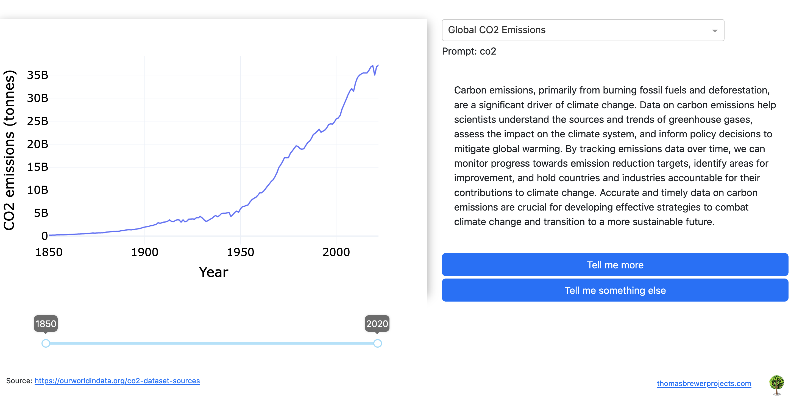

# Climate Dashboard - v1

**Description**

An interactive dashboard that showcases a couple important data in climate deregulation, 
accompanied by a minimalistic, out of the box, OpenAPI ChatGPT interface to explore the topic.
This prototype is only suited for very broad strokes on the topic, it is unrefined and is 
primarily an experiment in AI generated general education.

**Technologies**
- Framework: Plotly Dash 
- OpenAI SDK
- Heroku (dashboard host)
- Python Libraries: `openai`, `dash`, `pandas`...

**Concepts**

- Climate change metrics over time (CO2 emissions, sea level rise, average global temperature)
- Impacts of climate change on various factors of life. 
- Large Language Models (ChatGPT) 

**Limitations**

It is always important to note that ChatGPT can make mistakes. Like with anything else, it is up to us to think critically to evaluate the truth of the output, and check multiple sources of information. 

As it stands, this app is only meant to show some basic functionality. The GPT i s out of the box and not trained in any particular way. 

**Planned Updates**
- Train the GPT using a corpus of information on climate science. 
- Data Analysis Button
- Dynamic buttons based on the current context. 